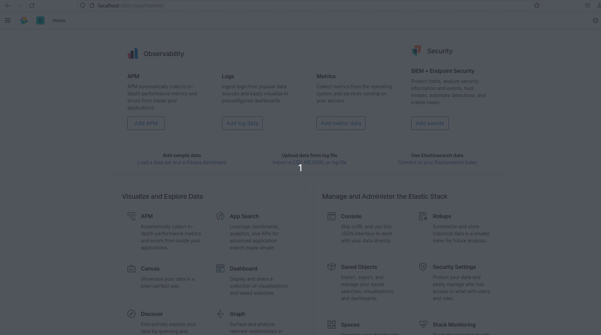
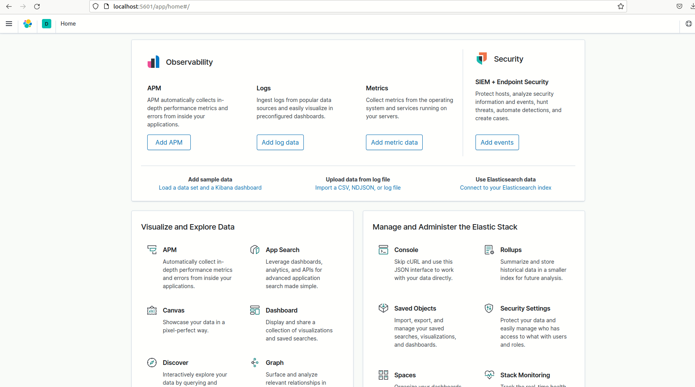
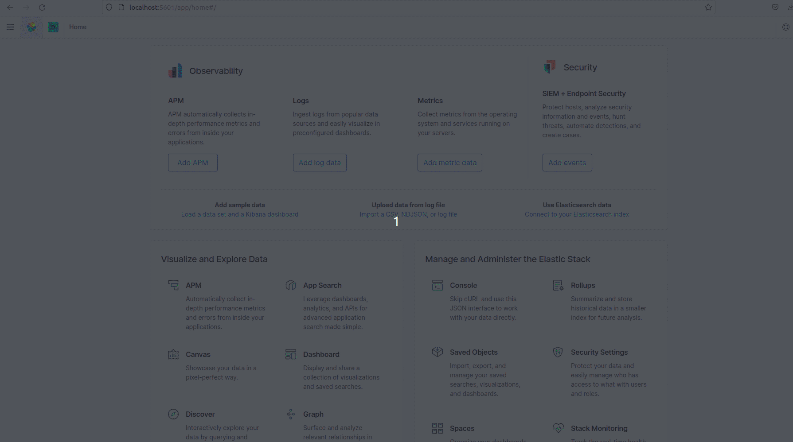

# Bulk API e Importação

1 . Importar os dados na Guia Arquivos para os índices

### - Índice: concessionaria2
  - dataset/cars.bulk
  
 
 

### - Índice: populacao

  - dataset/populacaoLA.csv
 
 
 
  
2 . Executar as consultas

- Contar o número de documentos de cada um dos novos índices

    GET populacao/_search

    GET concessionaria/_search

- Mostrar todos os documentos de cada um dos novos índices

    GET populacao/_count

    GET concessionaria/_count

### Vídeo demonstrativo

