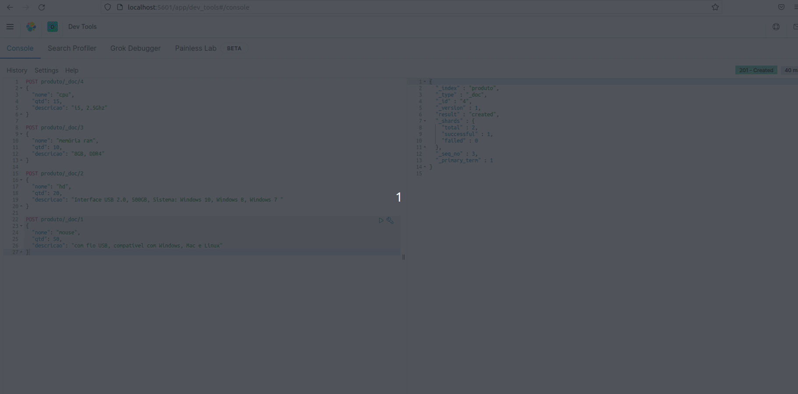
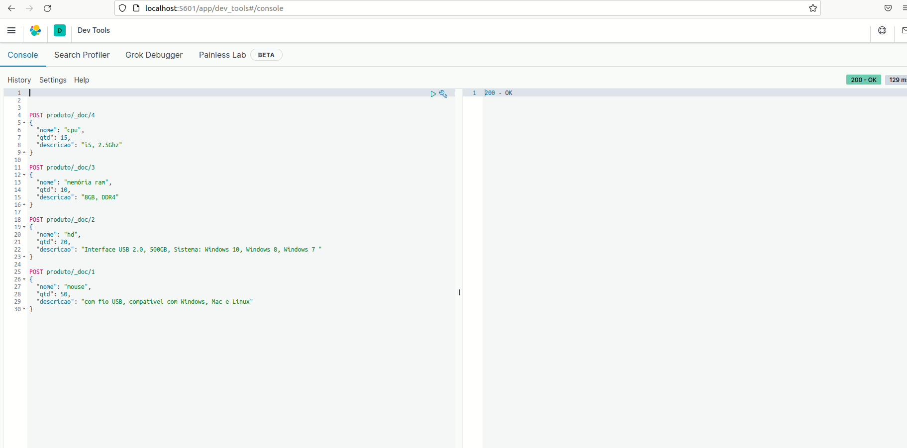
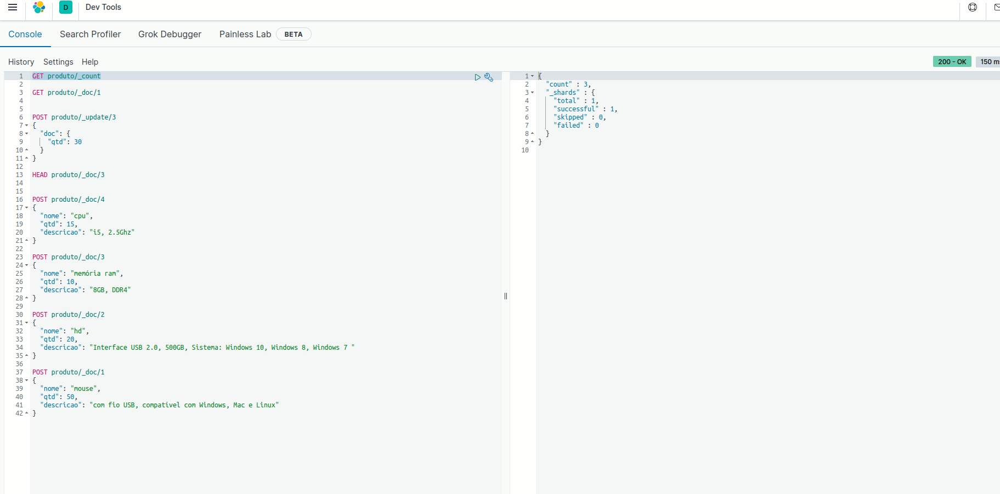

# CRUD

    -- Usaremos o Dev tools do Kibana

1 . Criar o índice produto e inserir os seguintes documentos:

- _id: 1, "nome": "mouse", "qtd": 50, "descricao": "com fio USB, compatível com Windows, Mac e Linux"

       POST produto/_doc/1
        {
          "nome": "mouse",
          "qtd": 50,
          "descricao": "com fio USB, compatível com Windows, Mac e Linux"
        }
        
    Resultado da requisição
    
        {
          "_index" : "produto",
          "_type" : "_doc",
          "_id" : "1",
          "_version" : 1,
          "result" : "created",
          "_shards" : {
            "total" : 2,
            "successful" : 1,
            "failed" : 0
          },
          "_seq_no" : 0,
          "_primary_term" : 1
        }

- _id: 2, "nome": "hd", "qtd": 20, "descricao": "Interface USB 2.0, 500GB, Sistema: Windows 10, Windows 8, Windows 7 "

        POST produto/_doc/2
        {
          "nome": "hd", 
          "qtd": 20, 
          "descricao": "Interface USB 2.0, 500GB, Sistema: Windows 10, Windows 8, Windows 7 "
        }
        
- _id: 3, "nome": "memória ram", "qtd": 10, "descricao": "8GB, DDR4"

        POST produto/_doc/3
        {
          "nome": "memória ram", 
          "qtd": 10, 
          "descricao": "8GB, DDR4"  
        }
- _id: 4, "nome": "cpu", "qtd": 15, "descricao": "i5, 2.5Ghz"

        POST produto/_doc/4
        {
          "nome": "cpu", 
          "qtd": 15, 
          "descricao": "i5, 2.5Ghz"
        }

2 . Verificar se existe o documento com  id 3

        HEAD produto/_doc/3

3 . Alterar o valor do atributo qtd para 30 do documento com id 3

        POST produto/_update/3
        {
          "doc": {
            "qtd": 30
          }
        }

4 . Buscar o documento com id 1

        GET produto/_doc/1

5 . Deletar o documento com id 4

        DELETE produto/_doc/4

6. Contar quando documentos tem o índice produto.

        GET produto/_count
        
### Visão geral do Dev Tools - ele executa por blocos

