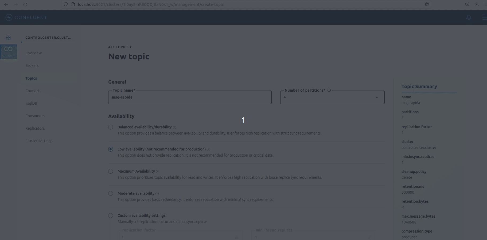
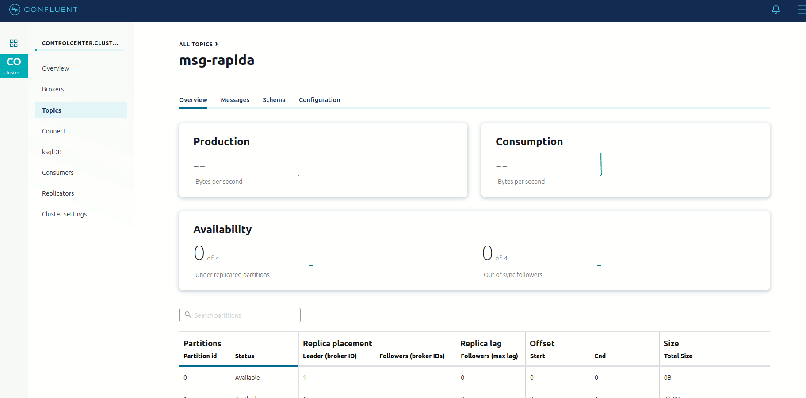
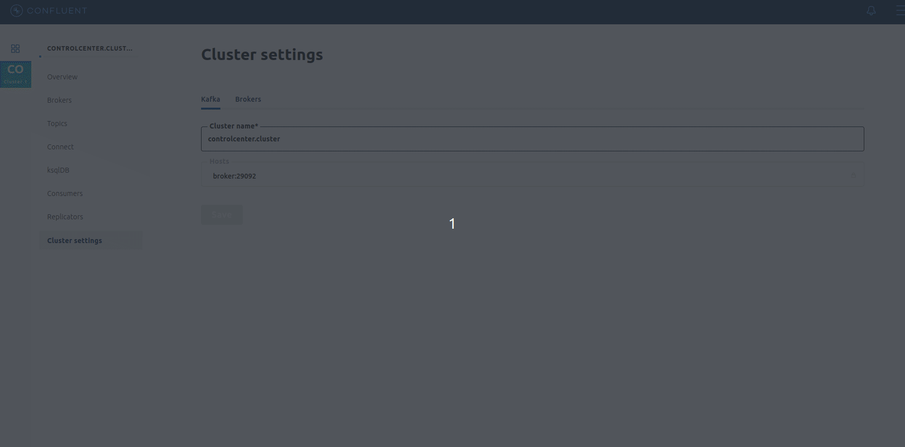
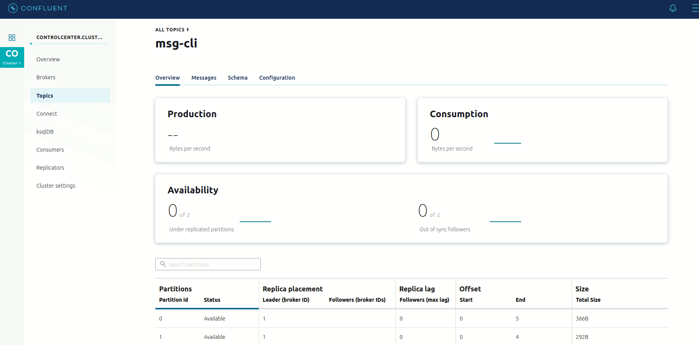
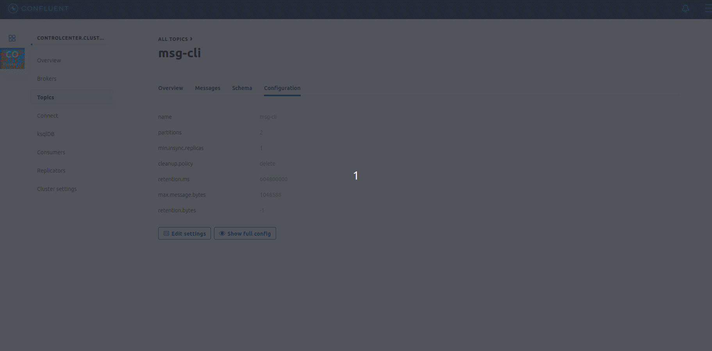
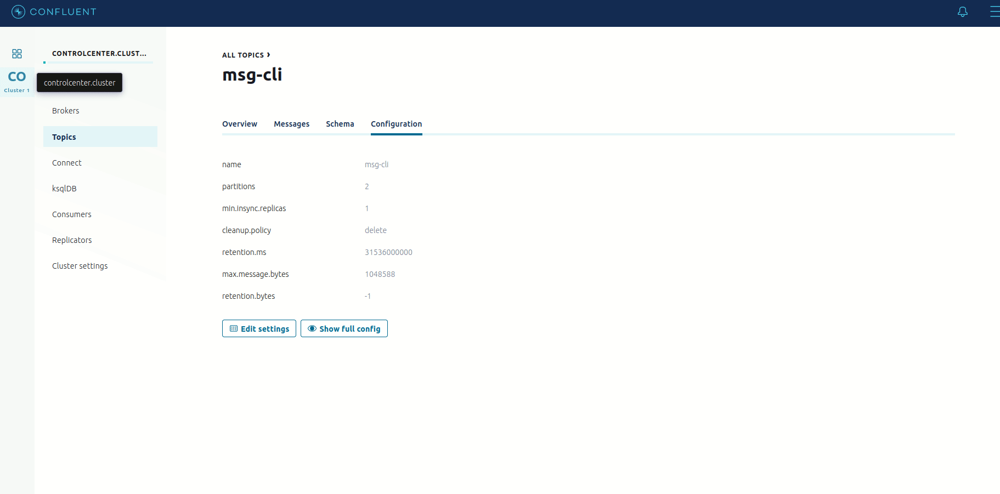
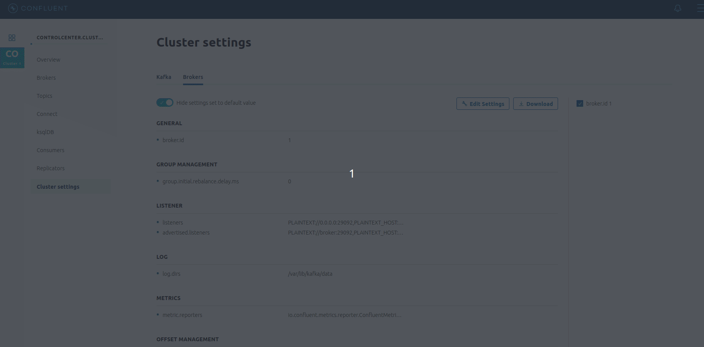
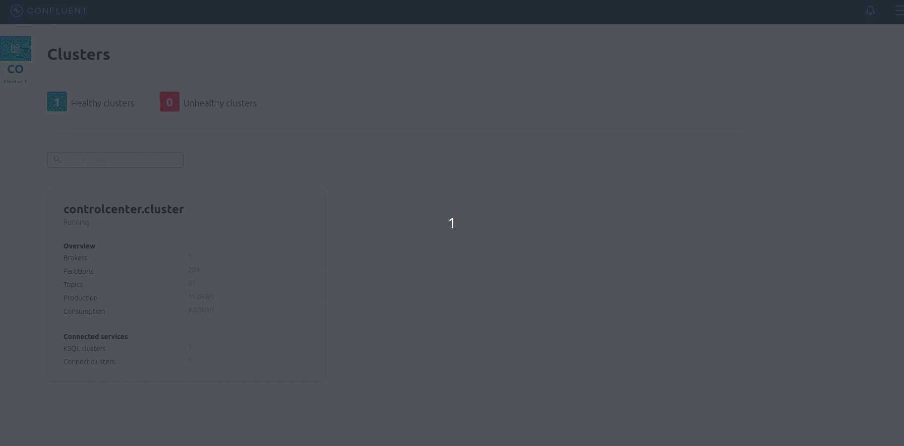

# Control Center

#### O Control Center é uma interface gráfica do Kakfa. Dispoível apenas na versão Community do Confluent.

###### Depois do cluster ativo, seu acesso é pelo endereço: http://localhost:9021/

1 . Criar um tópico com o nome msg-rapida com 4 partições, 1 replicação e deletar os dados após 5 minutos de uso.

2 . Produzir e consumir 2 mensagens para o tópico msg-rapida

    -- Para produzir mensagens utilizaremos o terminal através de nosso container
    -- inicialmente vamos disparar o consumidor    
    kafka-console-consumer --bootstrap-server localhost:9092 --topic msg-rapida
    
    -- em outro terminal vamos disparar o produtor
    kafka-console-producer --broker-list localhost:9092 --topic msg-rapida

    -- aqui no producer enviamos a mensagem que será recebida no consumer       

3 . Qual o nome do cluster?

4 . Quantos tópicos existem no cluster?

5 . Quantas partições existem o tópico msg-cli?

6 . Todas as réplicas estão sincronizadas no tópico msg-cli?

    Já mostramos a réplica no ecercício 5.

7 . Qual a política de limpeza do tópico msg-cli?

8 . Alterar a política de limpeza do tópico msg-cli para deletar depois de um ano.

     -- não temos a opçaõ de 1 ano. Digitamos e o Control Center já sugere

9 . Qual o diretório de armazenamento de logs do cluster?
    

10 . Por padrão os dados são mantidos por quantos dias no Kafka?

     -- por padrao o Kafka armazena por 7 dias
     -- dividindo as 168 horas por 24, equivale aos 7 dias
     -- na confguração o resultado é demonstrado em milisegundos(ms)

11 . Visualizar os gráficos de produção e consumo de dados do tópico msg-rapida.

 
