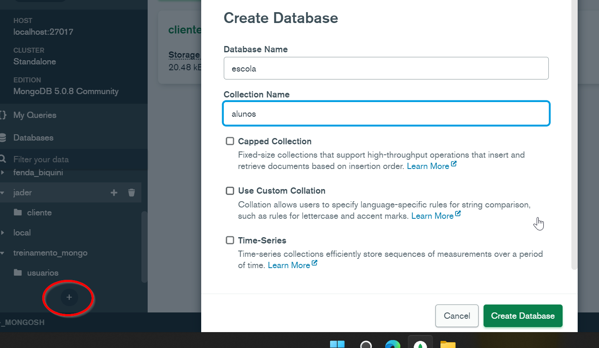
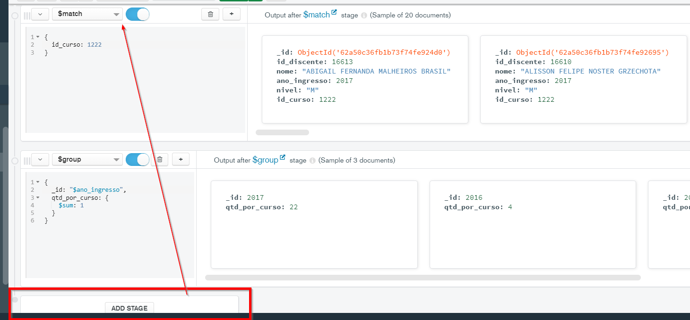

# CRUD através do MongoDB Compass

## Todas as questão devem ser realizadas através do MongoDB Compass

## 1. Criar a collection cliente no banco de dados seu nome

## 2. Inserir os seguintes documentos:

-nome: Rodrigo, cidade: São José dos Campos, data_cadastro: 10/08/2020

        {
          "nome": "Rodrigo", 
          "cidade": "São José dos Campos",
          "data_catastro": "10/08/2020"
        }

-nome: João, cidade: São Paulo, data_cadastro: 05/08/2020

          {
            "nome": "João", 
            "cidade": "São Paulo",
            "data_catastro": "05/08/2020"
          }
  
              
## 3. Buscar os documentos da cidade de São Paulo

## 4. Buscar os documentos da cidade de São Paulo e apresentar apenas o nome e a cidade

## 5. Atualizar o documento com nome João para cidade: Rio de Janeiro

## 6. Criar um index para o campo cidade em ordem alfabética

## 7. Deletar o documento com o nome João

## 8. Deletar a collection clientes

