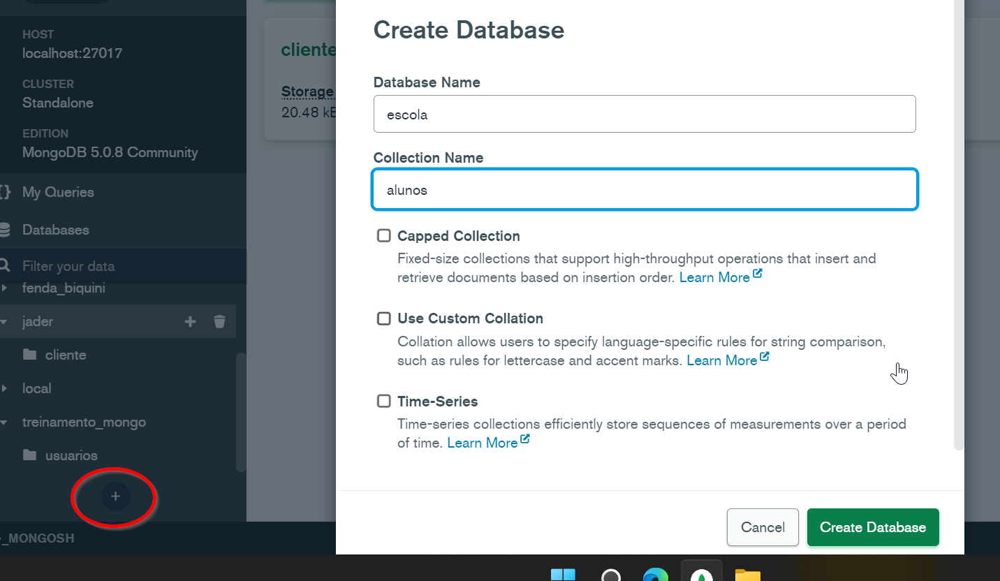
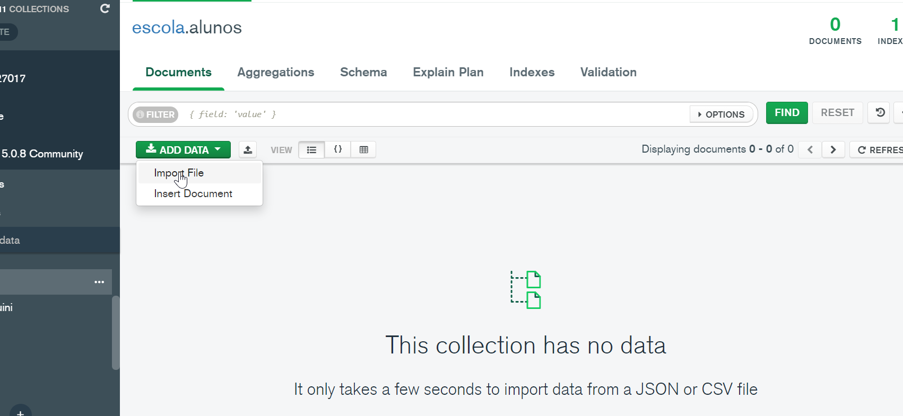
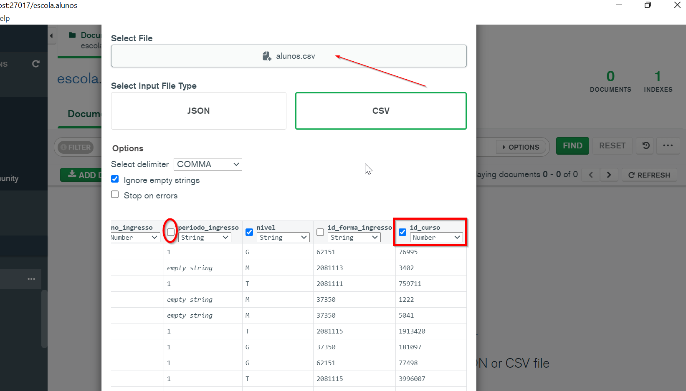
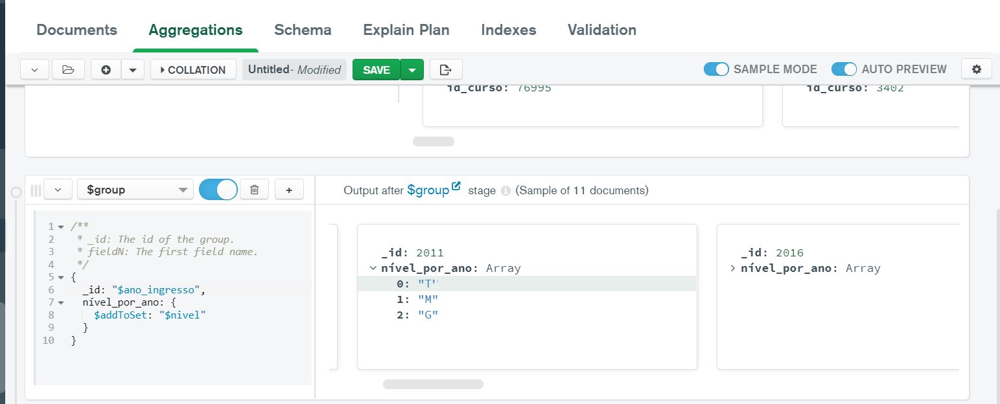
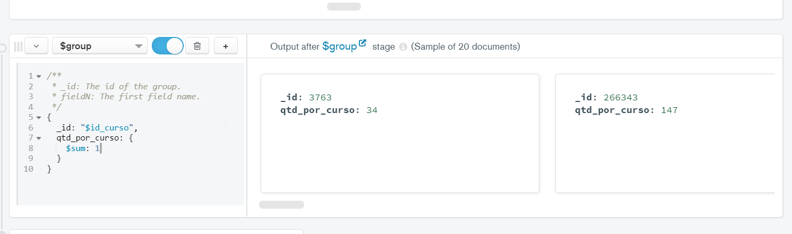

# Agregações de Match, Group, Sort e Limit

1. Crie o banco de dados escola
2. Crie a collection alunos no banco de dados escola

3. Importe o arquivo “dataset/alunos.csv” para a collection alunos, com os seguintes atributos:

- id_discente: Number
- nome: String
- ano_ingresso: Number
- nivel: String
- id_curso: Number
- Arquivos para Dataset

4. Visualizar os valores únicos do “nivel” de cada “ano_ingresso”

        {
          _id: "$ano_ingresso",
          nível_por_ano: {
            $addToSet: "$nivel"
          }
        }
        

5. Calcular a quantidade de alunos matriculados por cada “id_curso”

        -- Como o Mongo não possui um count, usamos o sum: 1
        -- nesta técnica ele conta 1 para cada linha
        
        {
          _id: "$id_curso",
          qtd_por_curso: {
            $sum: 1
          }
        }

6. Calcular a quantidade de alunos matriculados por “ano_ingresso” no "id_curso“: 1222

7. Visualizar todos os documentos do “nível”: “M”

8. Visualizar o último ano que teve cada curso (id_curso) dos níveis “M”

9. Visualizar o último ano que teve cada curso (id_curso) dos níveis “M”, ordenados pelos anos mais novos de cada curso

10. Visualizar o último ano que teve os 5 últimos cursos (id_curso) dos níveis “M”, ordenados pelos anos mais novos
