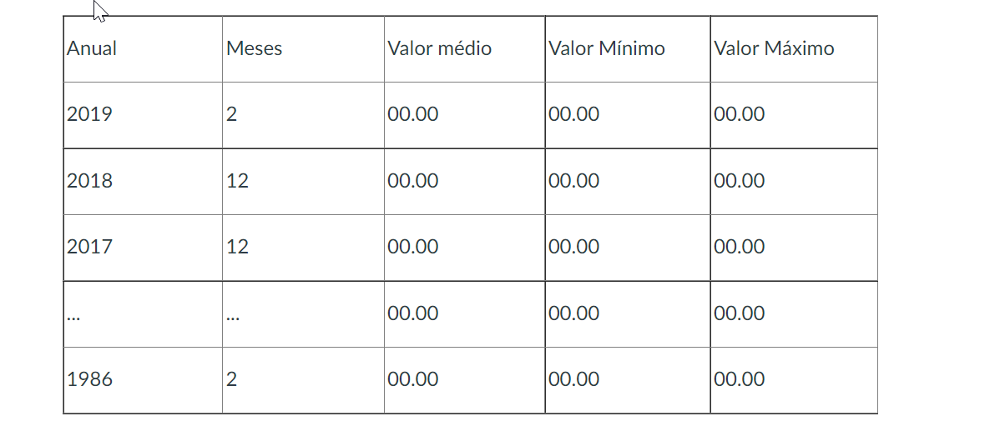

# Exercícios - WithColumn 2/2

1. Criar um dataframe para ler o arquivo no HDFS /user/<nome/data/juros_selic/juros_selic

        juros_selic = spark.read.csv("/user/jader/data/juros_selic/juros_selic", sep=";", header="true")
  

2. Agrupar todas as datas pelo ano em ordem decrescente e salvar a quantidade de meses ocorridos, o valor médio, mínimo e máximo do campo valor com a seguinte estrutura:

        -- vamos precisr da biblioteca sql.types
        from pyspark.sql.types import *

        -- primeiramente usamos uma estratégia de adicionar uma coluna de ano
        
        juros_selic_year =juros_selic.withColumn("year", split("data", "/").getItem(2))
        
        -- agora convertemos a coluna valor com regex para substituir a vírgula por ponto para somar e fazer média. 
        -- convertendo o campo para Float
        
        juros_selic_valor = juros_selic_year.withColumn("valor", regexp_replace(col("valor"),",",".").cast(FloatType())) 
        
    código final em única linha.
        
        juros_selic_table = juros_selic_valor.groupBy("year").agg(count("year").alias("months"), format_number(avg("valor"),2).alias("Valor médio"), min("valor").alias("Valor mínimo"), max("valor").alias("Valor máximo")).sort(desc("year"))

3. Salvar no hdfs:///user/<nome>/relatorioAnual com compressão zlib e formato orc

        juros_selic_table.write.orc("/user/jader/relatorioAnual",compression="zlib")
