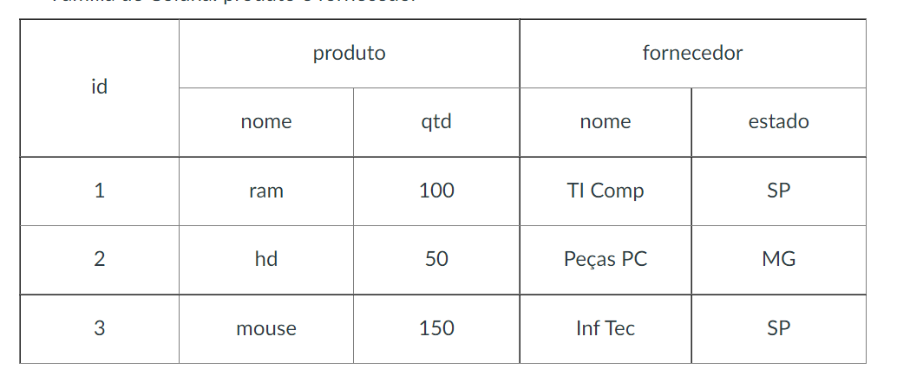

# HBase - Exercícios

1 . Criar a tabela ‘controle’ com os dados:

Chave: id  
Família de Coluna: produto e fornecedor

## Resoluçao

    -- primeiro vamos acessar o ambiente com HBase
    docker exec -it hbase-master bash
    
    -- agora acessamos ao shell 
    hbase shell
    
    -- Observação. O uso da chave e do atributo NAME não é obrigatório quando se tem apenas o nome
    -- usamos a chave quando queremos inserir informações adicionais
    -- poderia ser apenas create 'controle', 'produto', 'fornecedor'
    create 'controle', {NAME=>'produto'},{NAME=>'fornecedor'}
    
    --- inserindo os dados
    put 'controle', '1','produto:nome','ram'
    put 'controle', '2','produto:nome','hd'
    put 'controle', '3','produto:nome','mouse'
    
    -- para conferir pode fazer um scan
    scan 'controle'
    
    - seguindo a inserção dos dados
    put 'controle', '1','produto:qtd',100
    put 'controle', '2','produto:qtd',50
    put 'controle', '13','produto:qtd',150
    
    -- inserindo os dados do fornecedor
    put 'controle', '1','fornecedor:nome','TI Comp'
    put 'controle', '1','fornecedor:estado','RS'
    -- e segue os chaves2 e 3 com os dados da tabela
    
    
2 . Listar as tabelas e verificar a estrutura da tabela ‘controle’

    -- para listar as tabelas só executar o list
    list 
    
    -- para ver a estrutura com describe
    describe 'controle'
    
    scan 'controle'
    hbase(main):006:0> scan 'controle'
    
    Resultado
    
    
    ROW                                                 COLUMN+CELL                                                                                                                                            
     1                                                  column=fornecedor:estado, timestamp=1653849651434, value=SP                                                                                            
     1                                                  column=fornecedor:nome, timestamp=1653849620911, value=TI Comp                                                                                         
     1                                                  column=produto:nome, timestamp=1653848936379, value=ram                                                                                                
     1                                                  column=produto:qtd, timestamp=1653849332818, value=100                                                                                                 
     2                                                  column=fornecedor:estado, timestamp=1653849710409, value=MG                                                                                            
     2                                                  column=fornecedor:nome, timestamp=1653849788979, value=Pe\xC3\xA7as PC                                                                                 
     2                                                  column=produto:nome, timestamp=1653849072457, value=hd                                                                                                 
     2                                                  column=produto:qtd, timestamp=1653849356179, value=50                                                                                                  
     3                                                  column=fornecedor:estado, timestamp=1653849817455, value=SP                                                                                            
     3                                                  column=fornecedor:nome, timestamp=1653849802831, value=Inf Tec                                                                                         
     3                                                  column=produto:nome, timestamp=1653849080746, value=mouse                                                                                              
     3                                                  column=produto:qtd, timestamp=1653849362546, value=150                                                                                                 
    3 row(s) in 0.1410 seconds

3 . Contar o número de registros da tabela ‘controle’
  
    -- linha é equivalente a chave. Por isso retorna 3 linhas 
    -- estas chaves tem várias familias de colunas
    count 'controle'

4 . Alterar  a família de coluna produto para 3 versões

    alter 'controle', {NAME=>'produto',VERSIONS=>3}
    
    -- para conferir pode dar um describe
    describe 'controle'

5 . Alterar a quantidade para 200 do id 2

    -- como o HBase é real time, basta dar um put atualizando a informação
    put 'controle', '2','produto:qtd',200

6 . Pesquisar as versões do id 2  da coluna quantidade

    get 'controle','2',{COLUMNS=>'produto:qtd', VERSIONS=>2}
    
    -- RESULTADO
    COLUMN                                              CELL                                                                                                                                                   
     produto:qtd                                        timestamp=1653850505288, value=200                                                                                                                     
     produto:qtd                                        timestamp=1653849356179, value=50                                                                                                                      
    2 row(s) in 0.0590 seconds

7 . Excluir os id do estado de SP

    -- inicialmente faremos um scan 
    scan 'controle',{COLUMNS=>'fornecedor:estado', LIMIT=>5}

    ROW                                                 COLUMN+CELL                                                                                                                                            
    1                                                  column=fornecedor:estado, timestamp=1653849651434, value=SP                                                                                            
    2                                                  column=fornecedor:estado, timestamp=1653849710409, value=MG                                                                                            
    3                                                  column=fornecedor:estado, timestamp=1653849817455, value=SP                                                                                            
    3 row(s) in 0.0130 seconds

    -- consultando os dados com o filter
    scan 'controle',{COLUMNS=>'fornecedor:estado', LIMIT=>5, FILTER=> "ValueFilter(=, 'binary:SP')"}
    
    deleteall 'controle', '1'
    deleteall 'controle', '3'

8 . Deletar a coluna estado da chave 2

    delete 'controle', 2, 'fornecedor:estado'

9 . Pesquisar toda a tabela controle

    scan 'controle'

